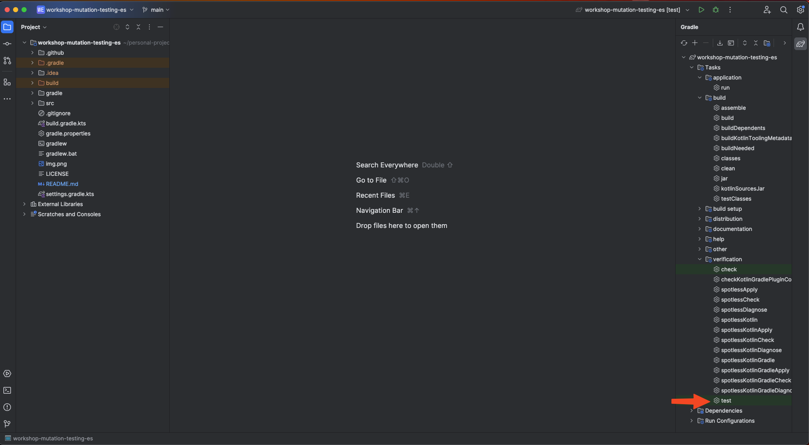
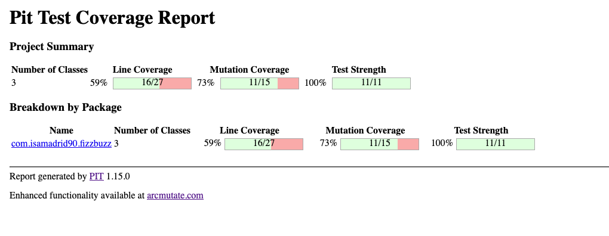

# Taller de Mutation Testing Castellano

El objetivo de este taller es entender qué es y comenzar a prácticar Mutation Testing.
Nos valdremos de la famosa kata FizzBuzz para entender cómo funciona

Tendréis algunas preguntas marcadas con ✏️ anota la respuesta cuando llegues a ellas.

```
DISCLAIMER: El objetivo de este ejemplo es permitirnos prácticar Mutation Testing,
por esa razón esta no es la implementación más optima
ni mejor de esta Kata en Kotlin, 
hay mejores opciones que no trabajan con código mutable pero no nos sirven para ilustrar lo que buscamos.
```

## Requisitos
Para poder llevar a cabo este taller necesitarás
* Hacer un fork de este repositorio para poder modificar el código que necesites
* Necesitarás editar código en Kotlin, puedes usar el IDE que prefieras pero los ejemplos los veremos con
  [IntelliJ IDEA](https://www.jetbrains.com/es-es/idea/download/) hay una versión gratuita Community y también hay un periodo
  de prueba en la versión Ultimate
* Ejecutar Gradle en tu ordenador, tienes varias formas de hacerlo:

1. Teniendo instalado jdk 17 en tu ordenador y ejecutando el siguiente comando, desde la raíz de este proyecto
   ```shell
   ./gradlew <nombre-tarea-gradle>
   ```
   Todo está preparado si, al finalizar la ejecución, ves en la consola un mensaje que dice `BUILD SUCCESSFUL` normalmente en color verde, pero esto no siempre es así.

2. Ejecutando gradle desde docker con el comando:
   ```shell
   docker run --rm -u gradle -v "$PWD":/home/gradle/project -w /home/gradle/project gradle gradle <nombre-tarea-gradle>
   ```
   Todo está preparado si, al finalizar la ejecución, en la consola ves un mensaje que dice `BUILD SUCCESSFUL`.

3. También podéis ejecutarlo desde IntelliJ 
Todo está preparado si, al finalizar la ejecución, ves un mensaje que dice `BUILD SUCCESSFUL` en la consola que ha abierto IntelliJ.


## Primer paso - Ejecutar los test

Lo primero que haremos será asegurarnos de que nuestros tests se ejecutan correctamente:
```shell
./gradlew test
```
```shell
docker run --rm -u gradle -v "$PWD":/home/gradle/project -w /home/gradle/project gradle gradle test
```

Con esto nos aseguramos de que todo está OK para poder seguir con el taller.

## Segundo paso - Mutamos nuestro código

Una vez que tenemos claros qué es un mutante y cómo lo capturamos, vamos a probar manualmente a hacerlo.

```
No penséis que esta es la forma más optima de ejecutar Mutation Testing, solo es para entender qué pasa por detrás de la librería que veremos a continuación.
```

### Mutante 1

Cambia en la clase `Main` la línea 7, donde comienza el while por el siguiente código y ejecuta los test
```kotlin
    while (position <= values.size) {
```
Lo que hemos hecho aquí es cambiar los límites de una condición para que incluya una última iteración.
Con el código original teníamos un bucle que se ejecutaba hasta que llegábamos al tamaño máximo de la lista, 
con este nuevo código ejecutamos el bucle una vez más.

✏️ ¿Han pasado los test? 

### Mutante 2

Cambia en la clase `Main` la línea 7, donde comienza el while por el siguiente código y ejecuta los test
```kotlin
    while (position >= values.size) {
```
Lo que hemos hecho aquí es cambiar negar la condición original.
Con el código original teníamos un bucle que se ejecutaba hasta que llegábamos al tamaño máximo de la lista. Ahora,
tenemos todo lo contrario.

✏️ ¿Han pasado los test? 

### Mutante 3

Cambia en la clase `FizzBuzzTranslator` modificando la línea 24, función `multipleOf15Translation`, para que devuelva un string vacío, como el código a continuación y ejecuta los test

```kotlin
private fun multipleOf15Translation() = ""
```

Lo que hemos hecho aquí es cambiar el resultado de la función, respetando el tipo que devuelve.

✏️ ¿Han pasado los test? 

## Tercer paso - Usar librería para ejecutar Mutation Testing

Una vez que hemos visto con nuestros propios ojos en qué consiste Mutation Testing, somos conscientes de que hay que hacer muchos cambios y 
ejecutar muchas veces los tests, algo que manualmente, nos llevaría demasiado tiempo. Por suerte para nosotros, existen librerías que ya hacen 
esto por si mismas, en este taller veremos como incorporar PITest a nuestro proyecto.

Primero añadiremos el plugin a nuestro `build.gradle.kts`
```kotlin
plugins {
    ...
    id("info.solidsoft.pitest") version "1.15.0"
}
```
Después añadiremos al final del fichero `build.gradle.kts` la configuración siguiente

```kotlin
pitest {
    junit5PluginVersion = "1.2.1"
    testPlugin = "junit5"
    targetClasses= listOf("com.isamadrid90.*")
    outputFormats = listOf("HTML")
}
```

Para ejecutarlo podemos utilizar los siguientes comandos

```shell
./gradlew pitest
```

```shell
docker run --rm -u gradle -v "$PWD":/home/gradle/project -w /home/gradle/project gradle gradle pitest
```

Una vez finalizada la ejecución con éxito podréis acceder a los informes en la ruta: `build/reports/pitest`.
Encontraréis un archivo `index.html`, si lo abrís con un navegador veréis algo como esto



## Cuarto paso - Mejorar la fiabilidad de nuestros test

Ahora que ya sabemos cómo obtener un informe de Mutation Testing, vamos a utilizarlo para mejorar la fiabilidad de nuestros test.
✏️ Necesitarás añadir nuevos tests o identificar cuáles de los existentes cubren los siguientes mutantes:

* En la clase FizzBuzzTranslator:
  1. Devolver lista vacía en la linea 17 ([Empty returns](https://pitest.org/quickstart/mutators/#EMPTY_RETURNS))
  2. Devolver string vacío en la linea 24 ([Empty returns](https://pitest.org/quickstart/mutators/#EMPTY_RETURNS))
  3. Devolver true en la linea 28 ([True returns](https://pitest.org/quickstart/mutators/#TRUE_RETURNS))

* En la clase Main:
  1. Cambiar límite condicional linea 7 ([Conditional Boundary](https://pitest.org/quickstart/mutators/#CONDITIONALS_BOUNDARY))
  2. Negar condicional linea 7 ([Negate Conditional](https://pitest.org/quickstart/mutators/#NEGATE_CONDITIONALS))
  3. Eliminar llamada linea 11 ([Void method calls](https://pitest.org/quickstart/mutators/#VOID_METHOD_CALLS))
  

## Quinto paso - Añadir Mutation Testing a GitHub Actions

A continuación lo que vamos a hacer es ejecutar PITest como parte de nuestro pipeline de GitHub Actions. 

Para eso modificaremos el archivo en `.github/workflows/pull-request.yml` y añadiremos un nuevo job `mutation-testing`.
Este nuevo job será prácticamente igual que el de `build`, excepto el paso `Build with Gradle`, nosotros tendremos que 
ejecutar el siguiente comando en lugar del build `./gradlew pitest`

Con esto estaríamos ejecutando PITest cada vez que crease o se hiciera push a una pull request 🎉

## Extra

El problema es que es imposible acceder al report que hemos visto antes ¿qué podemos hacer al respecto?

Teniendo en cuenta que para que la información se use tiene que ser muy fácil acceder a ella desarrollé [Gradle Pitest with summary comment](https://github.com/marketplace/actions/gradle-pitest-with-summary-comment)
Es fácil de usar, solo tendríamos que sustituir el último paso, el que habíamos añadido, por el siguiente cógido

```yaml
    - name: Execute PITest
      uses: isamadrid90/gradle-pitest-comment-action@v2.0.0
      with:
        repo-token: ${{ secrets.GITHUB_TOKEN }}
```
Con esto, cada vez que se ejecute esta pipeline se dejará un comentario en la pull request que lo ejecute. Además,
se subirá el informe en html completo como artifact que estará accesible en el resumen de la ejecución,
disponible desde la pestaña Actions del repositorio de GitHub, pinchando en una ejecución en concreto.

